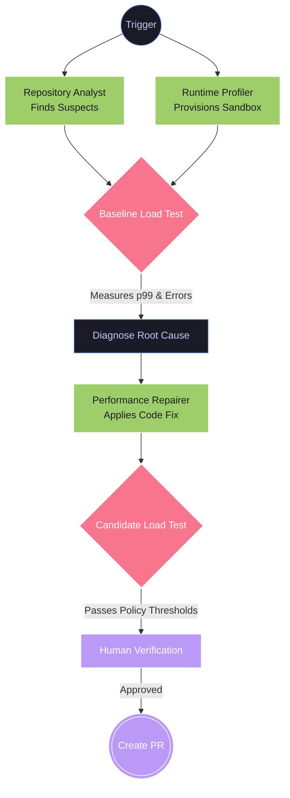

<div align="center">

# AEGIS
### Autonomous Runtime Reliability Agent

**The problem:** Node.js is single-threaded. A single CPU-bound task (massive JSON parsing, regex evaluation, sync crypto) blocks the event loop. Health checks fail. Tail latency spikes. Pods restart.
**The solution:** AEGIS. An autonomous agent that finds the bottleneck, reproduces the starvation under load, applies a targeted fix, and statistically proves the improvement before asking for a PR merge.

<br/>

[](https://github.com/truefoundry/trueforge)
[](https://nodejs.org)
[](https://www.typescriptlang.org)
[](https://nextjs.org)
[](https://www.qodo.ai)

</div>

---

## Submission Links

| Requirement | Link |
| --- | --- |
| Source code repository | https://github.com/Abhayanthk/aegis |
| Demo video (~3 min) | [video URL](https://youtu.be/KVJhn_XQTPY)|
| What it does + how it uses TrueForge | [Section Below](#how-it-uses-trueforge) |
| Qodo Code Review Evidence | [Section below](#qodo-code-review-evidence) |
| Blog post (optional prize) | [Medium Post](https://medium.com/@abhayanth2006/we-gave-an-ai-a-license-to-act-then-spent-48-hours-taking-away-its-license-to-lie-22f6b3b53a08) |

---

## The Pitch

Most AI coding agents guess at performance bugs by reading code. **AEGIS proves them.** 

It treats event-loop starvation like a Senior SRE:
1. **Reproduce:** Spins up a controlled load experiment.
2. **Measure:** Records hard data (p99 tail latency, event-loop delay).
3. **Repair:** Injects a targeted fix (worker threads, chunking, caching).
4. **Verify:** Re-runs the exact same load test to mathematically prove a >50% latency drop without breaking functional tests.

**The golden rule:** The LLM reasons and orchestrates. Deterministic scripts measure. The verifier decides pass/fail. The LLM cannot hallucinate a victory.

---

## System Architecture



---

## How It Uses TrueForge

AEGIS relies on [TrueForge](https://github.com/truefoundry/trueforge) as its core agent harness and execution engine.

```mermaid
sequenceDiagram
    participant User
    participant UI as Next.js Frontend
    participant API as Backend (Express + SDK)
    participant TF as TrueForge Engine
    participant Sandbox as Daytona Sandbox

    User->>UI: Start Investigation
    UI->>API: POST /api/chat
    API->>TF: Spawn Root Agent
    TF->>Sandbox: Clone Repo & Init Environment
    TF-->>API: Stream SSE Events (Live Logs)
    API-->>UI: Real-Time UI Updates
    
    rect rgb(26, 27, 38)
        Note over TF,Sandbox: Autonomous Closed Loop
        TF->>Sandbox: Run baseline load test
        Sandbox-->>TF: Metrics JSON
        TF->>TF: Diagnose starvation
        TF->>Sandbox: Apply repair patch
        TF->>Sandbox: Run candidate load test
        Sandbox-->>TF: Metrics JSON
        TF->>TF: Verify against strict policy
    end
    
    TF-->>API: Request Human Approval
    API-->>UI: Display Diff & Verdict
    User->>UI: Approve PR
```



### TrueForge Implementation Details:
1. **Sandboxed Execution:** The agent ships as a self-contained TrueForge skill (`aegis-runtime-reliability`). TrueForge executes all target code safely inside an isolated Daytona sandbox, entirely detached from the host.
2. **Subagent Delegation:** TrueForge enforces explicit memory boundaries between the *Repository Analyst*, *Runtime Profiler*, and *Performance Repairer* subagents. Because they share zero memory, context handoffs must be absolute—preventing LLM drift.
3. **SDK Orchestration:** We use `@truefoundry/trueforge-sdk` in our backend to orchestrate the agent lifecycle, streaming progress directly to the frontend so a human can monitor the state machine and authorize GitHub writes.

---

## Verification Gates & Guardrails

AEGIS is strictly governed by `config/verification-policy.json`. A candidate fix is **only** accepted if all gates pass:

| Metric | Requirement | Default Threshold |
| --- | --- | --- |
| **Event-loop p99** | Candidate/Baseline ratio | ≤ 0.25 (75%+ reduction) |
| **Target p99** | Candidate/Baseline ratio | ≤ 0.50 (50%+ reduction) |
| **Health Success Rate**| Absolute minimum | ≥ 0.99 |
| **Error Rate** | Errors / Total | ≤ 0.01 |
| **Functional Tests** | Pass Rate | 100% (No regressions allowed) |

*If `verify.mjs` exits with a `FAILED` verdict, the LLM is forcibly blocked from overriding it. Max 3 repair attempts before escalation.*

---

## Getting Started

**Prerequisites:** Node.js 18+, npm.

### 1. The Backend (Orchestrator)
```bash
git clone https://github.com/Abhayanthk/aegis.git
cd aegis/backend
cp .env.example .env # Add TrueForge credentials
npm install
npm run dev
```

### 2. The Frontend (Investigation UI)
```bash
cd ../frontend
cp .env.example .env # Add Clerk keys & backend URL
npm install
npm run dev # Opens http://localhost:3000
```

### 3. Run Standalone (Under the Hood)
```bash
cd ../aegis-runtime-reliability/scripts
npm install

# Reproduce the issue:
node run_experiment.mjs --config ../examples/experiment.json --output baseline/metrics.json

# Verify a fix:
node verify.mjs \
  --baseline baseline/metrics.json \
  --candidate candidate/metrics.json \
  --policy ../config/verification-policy.json \
  --output verdict.json
```

---

## Qodo Code Review Evidence

We enforce rigorous automated reviews using Qodo, initialized in [PR #1](https://github.com/Abhayanthk/aegis/pull/1) and active on every hackathon PR.

**Spotlight PR:** [#14 - refactor: fix 9 inefficiencies from full skill audit](https://github.com/Abhayanthk/aegis/pull/14)

This core refactor extracted 163 lines of repair examples into `repair-patterns.md`, formalized subagent handoffs, and centralized verification thresholds. 

**What Qodo Surfaced (And How We Responded):**
Following the summary, Qodo flagged two critical correctness bugs:
1. **Unresolved Path Logic:** Qodo identified a `{skill_dir}` placeholder that was passed into a file read by a subagent where token substitution would silently fail, breaking our repair examples. **We applied Qodo's fix to use an explicitly resolvable path.**
2. **Stale Thresholds:** Qodo caught a dangerous discrepancy: our failure diagnosis template claimed a 75% reduction target, while our policy strictly mandated a 50% reduction. This would have caused the agent to reject valid repairs. **We applied the fix to sync with the authoritative policy.**

We addressed 100% of Qodo's findings before merging in commit `1b62ce3`.

*(For the complete, unedited review trail, view our [merged pull request history](https://github.com/Abhayanthk/aegis/pulls?q=is%3Apr+is%3Amerged)).*

---

<div align="center">
  <br/>
  <i>Every fix is measured, not guessed. Built on TrueForge.</i>
</div>
